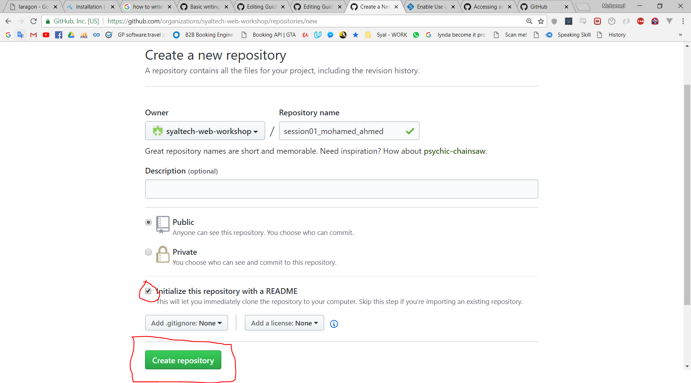

## Getting Up And Running
- Download laragon from the following [link](https://sourceforge.net/projects/laragon/files/releases/3.3/laragon-wamp.exe).
  - For the installation instructions check this [link](https://laragon.org/docs/install.html).
  - Laragon is a software that combines the tools most necessary for web developers(PHP + Apache + Git + Cmder + Nginx + Node js + ... ), For more infromation about it check its [website](https://laragon.org/) and [documentation](https://laragon.org/docs/)
  - To make all commands integrated with laragon work properly if you are using windows 10 please follow steps specified [here](https://www.isunshare.com/windows-10/enable-use-legacy-console-for-command-prompt-in-windows-10.html)  
  - To run any now and forth please use Laragon's Terminal .. You will find a shortcut for it in the laragon software 
  
- First Task: 
  - Sign in to your github account.
  - Switch to the organization you were invinted to (Syal web development Workshop)... [Here's how](https://help.github.com/articles/accessing-an-organization/)
  - Create new repo inside the organization. and name it session01_your_name (example session01_mohamed_ahmed) and tick the checkbox "Initialize this repository with a README" 
  
  
  - Now go to laragon software installed on your machine and do the following experiments. We are going to run commands to check the version of most of the tools integerated with laragon( This is useful practice not only to check the versions of the software you are using but also to check that every tool/service is up and running without issues).
    - On the repo you have just created on Github create a file named "up-and-running.md" and start editing it and foreach command you will run type the command in a line(prefixed with ## to treat it as a heading .. example .. ## php -v) in the file followed by the output of the command in another line: 
    - The commands to try are: 
      - php -v
      - httpd -v
      - nginx -v
      - node -v
      - npm -v
      - composer -V
      - git --version
    - Here's an [example repo] with the file needed and the output of an example command from the above .. when viewing the file ["up-and-running.md"](https://github.com/syaltech-web-workshop/session01_mohamed_ahmed/blob/master/up-and-running.md) click on raw button to check how it's written to get the heading formatted
      
